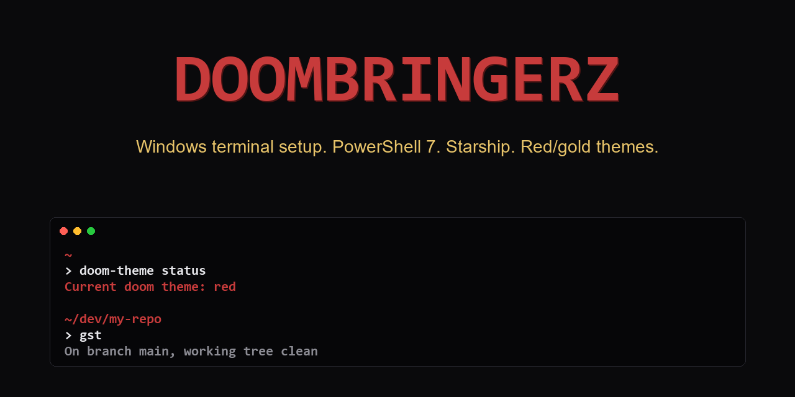

# win-rice-doombringerz

> My Windows terminal setup. One line. Looks like mine. Runs like mine.

PowerShell 7, Starship prompt, Windows Terminal config, and a small set of PowerShell aliases. Made by [Doombringerz](https://doombringerz.com).

## What's in it

- `powershell/profile.ps1`, aliases (git shortcuts, navigation, helpers), Starship init, `doom-theme` switcher, `doom-banner`
- `powershell/starship-red.toml`, **red dominant / gold accents** theme (default, doom-coded)
- `powershell/starship-gold.toml`, **gold dominant / red accents** theme (ascended counterpart)
- `terminal/settings.json`, Windows Terminal reference config: dark theme, JetBrains Mono Nerd Font, acrylic transparency, sensible scrollback
- `install.ps1`, one-line installer (read it first, then paste)

## Install

```powershell
irm https://raw.githubusercontent.com/Doombringerz/win-rice-doombringerz/main/install.ps1 | iex
```

What the installer does:

1. Clones (or updates) the repo to `~/.win-rice-doombringerz`
2. Installs Starship (scoop or winget) if you don't have it
3. Installs JetBrainsMono Nerd Font if you don't have one: machine-wide when you run it elevated, otherwise per-user (admin terminals need machine-wide, see Requirements)
4. Backs up your existing `$PROFILE` to `$PROFILE.backup.YYYYMMDDHHMMSS`
5. Sources `profile.ps1` from your `$PROFILE`
6. Backs up your existing `~/.config/starship.toml` (if any) and installs the new one
7. Prints Windows Terminal settings reference (does NOT auto-overwrite your terminal settings)

If you don't trust pasting blind, [read install.ps1 first](https://github.com/Doombringerz/win-rice-doombringerz/blob/main/install.ps1).

## Requirements

- Windows 10 / 11
- PowerShell 7+ (PS 5.1 works for the basics)
- Windows Terminal (recommended)
- A Nerd Font. `install.ps1` installs JetBrainsMono Nerd Font for you (scoop, winget, or a
  per-user download) and skips it if you already have one. Without it, Starship's git/node/rust
  icons render as `[?]`. Two gotchas: set the font in Windows Terminal too, or the icons stay
  broken (`"profiles": { "defaults": { "font": { "face": "JetBrainsMono Nerd Font" } } }`); and
  for admin terminals install it machine-wide by running the installer elevated. Per-user
  fonts do not load in elevated processes.

## Customize it

It's yours. Change one thing per week:

- `profile.ps1`, add your own aliases or functions
- `starship.toml`, tweak segments at [starship.rs/config](https://starship.rs/config/)
- `terminal/settings.json`, adjust colors, opacity, font

## Aliases included

Git: `gst`, `gd`, `gds`, `ga`, `gaa`, `gc`, `gcm`, `gca`, `gco`, `gcb`, `gb`, `gp`, `gps`, `gpr`, `glog`, `gloga`, `gwip`

Navigation: `ll`, `..`, `...`, `....`, `mkcd`, `here`

Misc: `reload-profile`, `du-summary`, `which`

## Doombringerz commands

### `doom-theme`: switch between red and gold

The setup ships with two themed Starship configs. Swap between them with one command:

```powershell
doom-theme red       # red dominant, gold accents (doom-coded, default)
doom-theme gold      # gold dominant, red accents (ascended counterpart)
doom-theme auto      # red 18:00-06:00, gold 06:00-18:00 (time-based)
doom-theme status    # show which theme is currently active
```

After switching, open a fresh terminal to see the new prompt.

### `doom-banner`: print the ASCII logo on demand

```powershell
doom-banner
```

Prints the Doombringerz wordmark in red plus tagline in gold. Not auto-shown on shell start (that gets annoying fast). Run it manually when you want it.

## License

MIT, see [LICENSE](LICENSE).

## Related

- [doombringerz.com](https://doombringerz.com)
- [oh-boi-cli](https://github.com/Doombringerz/oh-boi-cli), ADHD focus tracker + fail logger
- [doombringerz-vault](https://github.com/Doombringerz/doombringerz-vault), Obsidian ADHD-friendly starter vault
